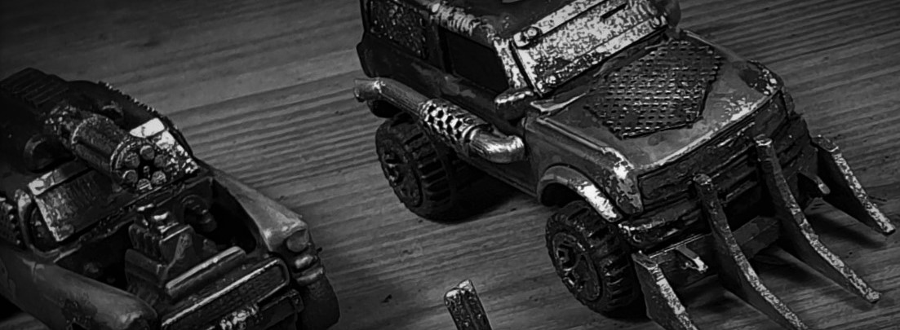

# Scraplands

Scraplands is a post apocalyptic combat game module for the Open Fire tabletop wargame system. It features heavily modified diecast cars, brimming with armour and weapons, and 20mm miniatures of almost any style you choose to use.

### [Get the core rules for Open Fire](https://github.com/open-source-tabletop/openfire/)

# Scraplands Modules

### [Scraplands: Bad Blood](https://github.com/open-source-tabletop/openfire-gm-scraplands/blob/main/scraplands-bad-blood.md)
### [Scraplands: Outcasts](https://github.com/open-source-tabletop/openfire-gm-scraplands/blob/main/scraplands-outcasts.md)
### [Scraplands: Showdown](https://github.com/open-source-tabletop/openfire-gm-scraplands/blob/main/scraplands-showdown.md)