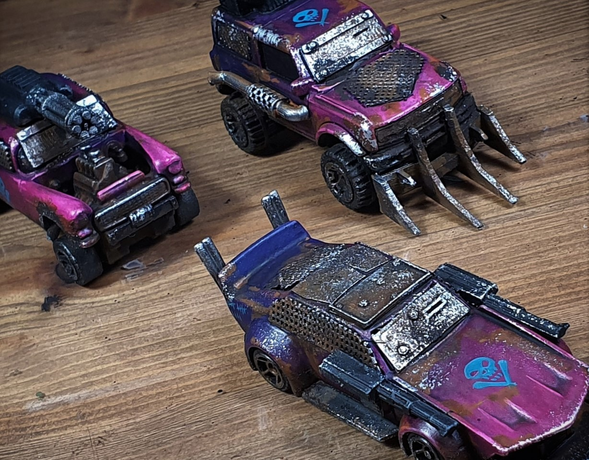

# Wasteland Rally

Wasteland Rally is a post apocalyptic vehicle combat game module for the Open Fire tabletop wargame system. It uses heavily modified diecast cars, brimming with armour and weapons, to represent the ramshackle and deadly vehicles of the most popular sport in the Wasteland.

### [Get the core rules for Open Fire](https://github.com/open-source-tabletop/openfire/)

### [Wasteland Rally Game Module Rules](https://github.com/open-source-tabletop/openfire-gm-wasteland-rally/blob/main/wasteland-rally-game-module.md)